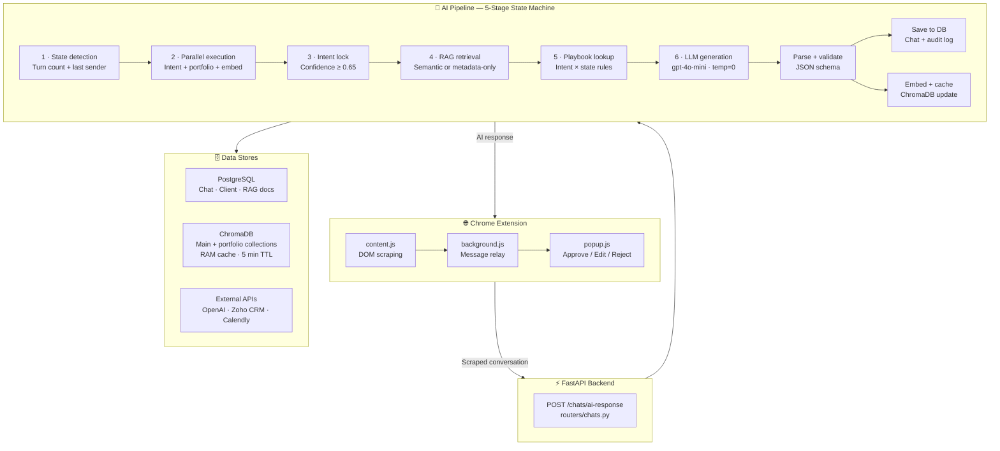
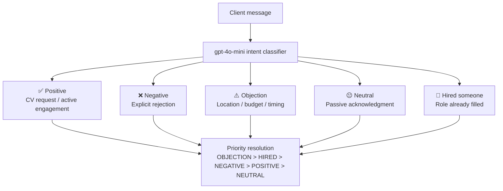
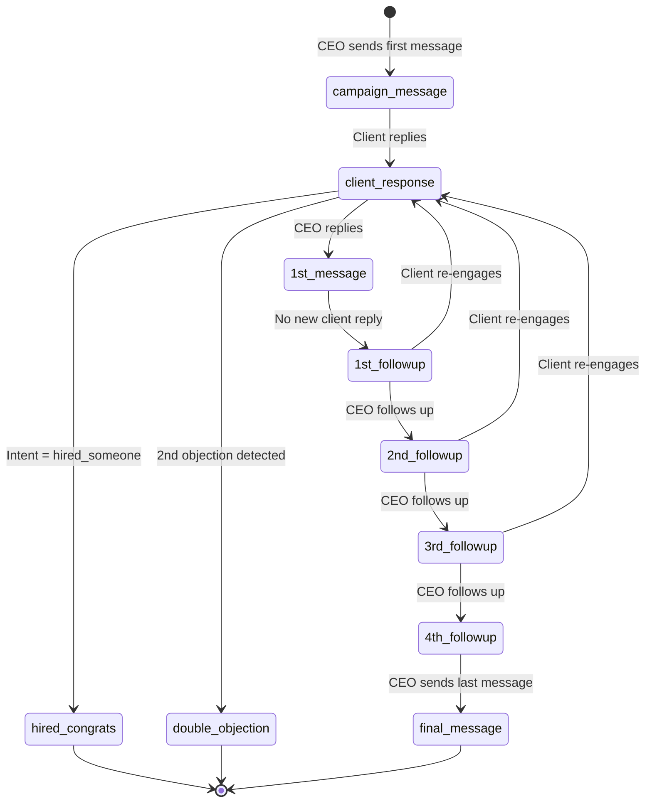
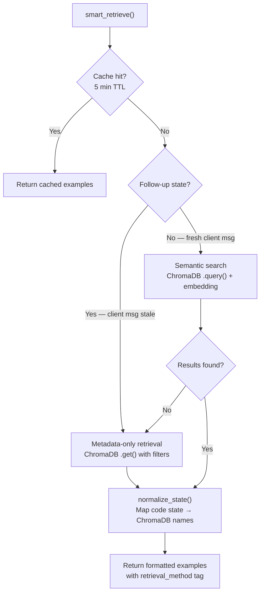

# System Architecture

## End-to-End Flow

---

## Intent Classification

---

## Conversation State Machine

---

## RAG Retrieval Logic

---

## Performance

| Metric | Value |
|--------|-------|
| End-to-end latency | ~5 seconds |
| Daily conversations | 100+ |
| Intent detection accuracy | 90%+ |
| CRM duplicate contacts | 0 |
| Downtime since launch | 0 |

> ⚠️ Source code is proprietary. This repo contains architecture documentation only.
